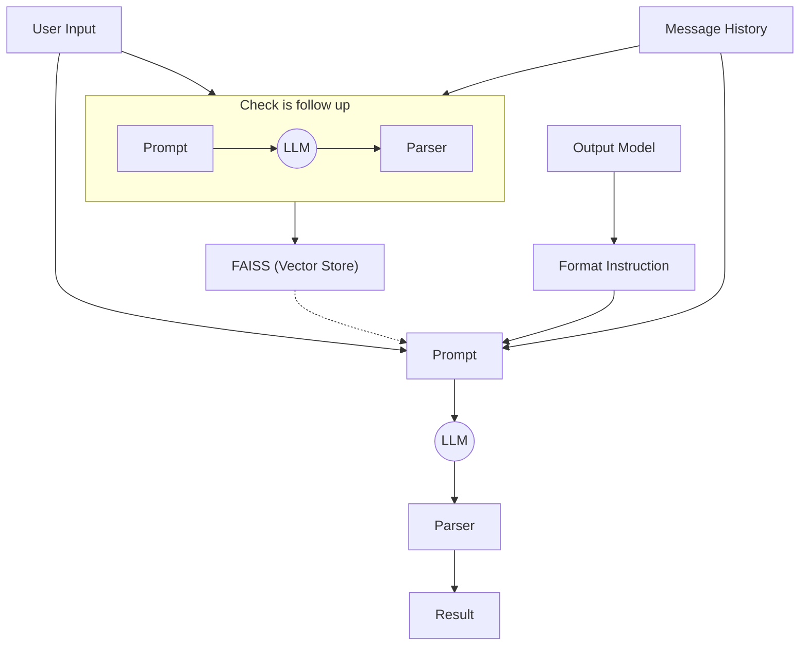

# RAG Agent

A full-stack Retrieval-Augmented Generation (RAG) agent combining a FastAPI backend (Python) with a modern React + TypeScript frontend. The backend leverages FAISS (and optionally Pinecone) for vector-based retrieval, integrates with LLMs (e.g., OpenAI GPT), and exposes APIs and websockets for conversational and retrieval tasks. The frontend provides a sleek, real-time chat interface.

---

## Project Purpose

The RAG Agent enables intelligent, context-aware conversations by augmenting large language models with efficient retrieval from a vector store. It is designed for applications such as recipe generation, knowledge assistants, or any scenario where grounding LLMs with domain data is valuable.

---

## Features

**Backend (FastAPI, Python):**

- Retrieval-augmented generation using FAISS or Pinecone vector stores
- Integration with OpenAI LLMs for response generation and embeddings
- Modular service and repository layers (e.g., for drinks, ingredients)
- WebSocket and REST API endpoints (`/retrieve`, `/generate`)
- Environment-based configuration, scalable and extensible design

**Frontend (React, TypeScript, Vite):**

- Real-time chat UI with WebSocket support
- Modern, responsive design using Ant Design components
- Type-safe, modular codebase

---

## Setup Flow

### 1. Clone the Repository

```bash
git clone <repo-url>
cd rag-agent
```

### 2. Backend Setup

#### Backend Prerequisites

- Python 3.8+
- [uv](https://github.com/astral-sh/uv) (for Python package management)
- (Optional) Docker for containerized deployment

#### Installation

```bash
cd backend
# Create a virtual environment
uv venv .venv
```

#### Configuration

- Copy `.env.example` to `.env` and fill in required values (API keys, etc.)

#### Database & Vector Store

- By default, uses SQLite and FAISS. Pinecone can be enabled via environment variables.

#### Running the Backend

```bash
uv run uvicorn --app-dir app main:app --reload
```

- API: [http://localhost:8000](http://localhost:8000)
- WebSocket: [ws://localhost:8000](ws://localhost:8000)

### 3. Frontend Setup

#### Frontend Prerequisites

- Node.js 16+
- pnpm (recommended), npm, or yarn

#### Installation

```bash
cd ../frontend
pnpm install # or npm install or yarn install
```

#### Running the Frontend

```bash
pnpm dev # or npm run dev or yarn dev
```

- App: <http://localhost:5173>

---

## Architecture



---

## Tech Stack

- **Backend:** FastAPI, FAISS, Pinecone, SQLAlchemy, LangChain, OpenAI, uv
- **Frontend:** React, TypeScript, Vite, Ant Design, Socket.IO

---

## License

[MIT](LICENSE) (or specify your license)
