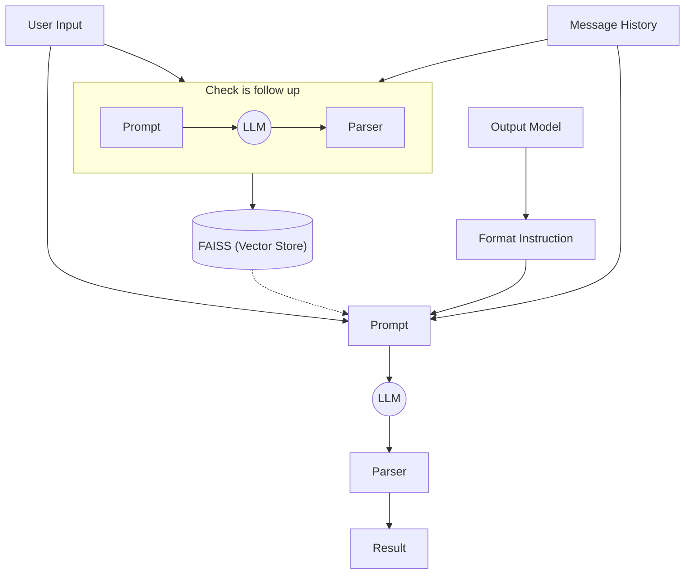

# RAG Agent Backend Application

## Description

This is a RAG (Retrieval-Augmented Generation) agent that uses a FAISS vector store to retrieve relevant information and generate new content.

## Usage

1. Set up the environment variables:
2. Run the application:
3. Access the API endpoints:

- `http://localhost:8000/retrieve` (GET)
- `http://localhost:8000/generate` (POST)

## Flowchart

